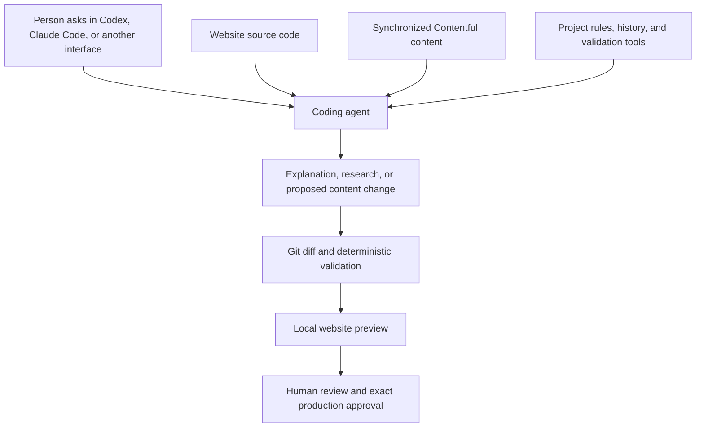

# Talk to your Contentful website with an AI coding agent

Ask Codex, Claude Code, or another coding agent to find content across a website, explain where it is used, prepare better wording, update the allowed Contentful values, and open the real site locally for review.

This repository is a working reference for teams that want that conversational experience without giving an AI agent an unchecked path to production. It brings the website code, synchronized CMS content, project rules, validation, and local preview into one agent-readable context.

Instead of clicking through many CMS entries or asking a developer to locate every occurrence manually, a person can start with a normal request such as:

```text
Find every page that uses the old service name. Propose a clearer replacement,
update the existing Contentful values, validate the change, and open the local
website preview. Do not publish anything.
```

The agent searches both content and code, shows a reviewable Git diff, runs deterministic checks, and helps start the local site. A person sees the proposed wording in its real page context and keeps the final publishing decision.

Adexin created and used this workflow with OpenAI Codex. Codex is not a runtime dependency or a requirement: the same repository can be operated with Claude Code, another coding agent, or manually from a terminal. The safety comes from the workflow and its checks, not from a particular AI product.

Adexin built and tested the original implementation on the **Contentful Free** plan. It does not require Contentful Enterprise, Studio, or AI Actions. Contentful pricing and plan terms can change, so the current public options and an important commercial-use caveat are explained separately below.

This public version is fictional and contains no credentials, private URLs, or customer content. It is intended as a reference that other teams can study, adapt, or use as the starting point for their own solution.

## A conversational interface to the website

The simplest way to think about this project is that Codex or another coding agent becomes a conversational interface to the website.

After the repository has been configured, a person does not need to remember Contentful entry IDs, search through many CMS screens, or know where every piece of text is stored. They can describe the result they need in ordinary language, while the agent works with the website source, synchronized Contentful content, project instructions, and validation tools in one context.

For example, a person can ask:

```text
Where is the logistics service description used on the site?
```

```text
Find every page that still uses the old product name and show me the matches.
```

```text
Prepare a clearer hero heading for the services page, update the existing
Contentful value, validate it, and stop so I can review the diff.
```

```text
Start the local preview for the proposed content and help me decide what I should
check before we publish it.
```

The agent can search the synchronized content and website code, explain what is where, prepare new wording, make the allowed working-file edits, validate them, and help run the local preview. A person can then inspect the real page instead of approving text without its visual context. If the agent environment has browser or screenshot tools, the agent can also inspect the rendered preview; otherwise the local URL remains available for human review.



This is useful even when no content is changed. The same context can help the agent answer questions about the site, locate repeated or inconsistent wording, explain which Contentful entries feed a page, and prepare a content inventory for a person to review.

## What can be added next

The current reference implements the safe content-change and Gatsby-review path. It also provides a foundation for additional agent capabilities, for example:

- researching a topic, audience, or competitor and preparing source-backed content recommendations;
- auditing page titles, descriptions, headings, internal links, image text, and other on-page SEO elements;
- preparing SEO improvements as a reviewable batch instead of publishing them automatically;
- finding outdated claims, duplicated copy, inconsistent terminology, and missing translations;
- checking content against brand, accessibility, legal, or editorial rules supplied by the project owner;
- combining content context with analytics or search data to propose higher-impact updates;
- adapting the preview step to Next.js, Nuxt, Astro, SvelteKit, mobile applications, or another frontend;
- adding new bounded workflows for assets, new entries, or content-model changes.

These are extension opportunities, not capabilities that this repository claims to provide out of the box. Research needs approved sources or browsing tools, analytics needs an authorized integration, and SEO rules need to be defined for the project. Any new write capability should receive the same treatment as the existing workflow: limited scope, deterministic validation, preview, recoverable execution, and explicit human approval.

That is the larger potential of the approach. Once an agent can understand the code, content, structure, rules, and preview of a website together, the team can add many useful operations without giving up control of production.

## The problem it is designed to solve

Content updates often look harmless. A team may only want to change a headline, rewrite several service pages, fix metadata, or update the same message in multiple locales. In a headless CMS, however, even a small edit can be difficult to review as one complete change.

Common problems include:

- **There is no simple pull request for a group of CMS edits.** Reviewers may need to open many Contentful entries and remember what each value looked like before.
- **Preview and production can drift apart.** A change reviewed yesterday may no longer be the same change that reaches production today.
- **A valid field value can still break a page.** The content may satisfy the Contentful schema but produce a missing route, broken reference, or failed frontend build.
- **Approvals can be ambiguous.** “Looks good, publish it” does not identify the exact content, frontend version, environment, and credentials that were reviewed.
- **Automation can write to the wrong target.** A wrong environment ID, token, API host, or fallback to `master` can turn a preview operation into a production incident.
- **Retries after partial failure are risky.** If some entries were updated before a command failed, starting the command again may make the state harder to understand.
- **AI makes bulk editing easier, but also increases the blast radius.** An agent can prepare many useful changes quickly; it can also repeat a bad assumption across many entries quickly.

This project treats content publishing more like a careful software release: visible changes, repeatable validation, a real preview, an exact candidate, and explicit human control over production.

## What the workflow does

The repository separates content preparation from remote publication.


In plain language:

1. **Sync:** download one complete, known generation of published preview content.
2. **Edit:** change only the allowed values in `content/working/**`.
3. **Review:** inspect an ordinary Git diff instead of comparing entries by memory.
4. **Validate:** check the content against the synchronized Contentful schema and create a deterministic changeset.
5. **Preview:** apply only that changeset to the preview environment.
6. **Test the website:** start a disposable Gatsby copy from an exact reviewed commit, refresh its Contentful data, enumerate its routes, and check every route response.
7. **Prepare production:** compare the reviewed change with the current production state without writing to production.
8. **Approve the exact candidate:** require a fresh confirmation containing the candidate digest and target environment.
9. **Execute and verify:** update and publish only the reviewed entry fields, then verify the result through both the management and delivery APIs.
10. **Close:** take a fresh preview snapshot so the next change starts from a clean baseline.

Each remote phase is separate. Successfully validating content does not authorize a preview write. Successfully reviewing preview does not authorize production preparation. Preparing a production candidate does not authorize publishing it.

## What makes this different from a prompt

The workflow does not depend on asking an AI model to “be careful.” Its important guarantees are implemented by deterministic code.

- The project profile binds the exact Contentful space, preview environment, production environment, production alias, locale, Gatsby project, and review port.
- Credentials are accompanied by target attestations for the expected API host, space, and environment.
- Preview and production use separate credentials.
- Production preparation uses a read-only management credential.
- The production write credential is only needed after the exact candidate has been prepared and approved.
- Changesets and production candidates have SHA-256 digests.
- Git commits bind the reviewed workflow code and Gatsby code to the evidence.
- Production is checked for version or content drift immediately before the first write.
- Apply, production execution, and close keep journals around every remote mutation.
- A failed, partial, in-flight, or unknown journal blocks automatic retry and asks for operator review.

The agent helps with understanding and editing. The scripts decide whether a particular operation is allowed to proceed.

## What can be changed

This reference deliberately supports a narrow and auditable job: changing existing localized field values in existing Contentful entries.

It rejects changes that add or delete resources, fields, or locales, modify Content Type or Asset metadata, change entry identity, or silently change a field's JSON shape. This keeps the review surface small and prevents a content-edit request from turning into an unreviewed schema migration.

The approach can be extended, but new capabilities should be added as explicit workflows with their own validation, tests, permissions, and approval boundaries.

The reference also does not deploy the Gatsby site or change the production alias. It verifies content against a disposable local Gatsby copy and publishes approved entry values to the configured concrete production environment. Application deployment and alias changes remain separate operational decisions.

## Who may find it useful

This pattern is most relevant when:

- Contentful powers an important marketing, documentation, ecommerce, or product site;
- a team needs to update several entries or locales as one reviewed batch;
- developers want CMS changes to have a Git diff and review history;
- content is prepared with Codex, Claude Code, or another AI coding agent;
- preview must be checked against the actual frontend before publication;
- publishing the wrong value or the wrong batch would be expensive;
- the team wants a custom workflow around Contentful's APIs instead of relying only on manual dashboard steps.

It may be unnecessary for a small site where one editor makes isolated changes directly in Contentful and the built-in preview and publishing flow already provides enough control.

## Contentful plan and cost

The workflow itself is an open-source reference released under the MIT License. It uses Contentful's management, preview, and delivery APIs and implements its own repository-level diff, validation, preview, approval, drift, and recovery controls. It does not depend on Contentful Studio, AI Actions, or an Enterprise-only agent product.

The original Adexin implementation was successfully built and tested with a **Contentful Free organization and its included Starter Space**. This demonstrates that the technical workflow can be created without buying Contentful's paid AI, visual-editing, or Enterprise products.

As of September 2, 2026, [Contentful's official pricing page](https://www.contentful.com/pricing/) lists:

- **Free — $0:** one included Starter Space, intended by Contentful for learning and exploring;
- **Lite — $300 per month:** the lowest publicly listed paid platform plan, including one Starter Space;
- **Enterprise — custom pricing.**

The number **20** on the current Lite plan refers to included users, not a $20 monthly price. Contentful also states that its current Free plan is not permitted for commercial production use. Running and testing this workflow on Free therefore does not by itself mean that Free is contractually suitable for another team's production website. Each team must confirm that its subscription is valid for its own use case. Older accounts may have legacy plan names and pricing; check the organization's billing page before describing a specific account publicly.

This reference does not make the Contentful subscription itself cheaper. Its potential economic value is elsewhere: reducing repetitive developer work, making multi-entry changes reviewable, finding content faster, reusing the existing frontend, and adding a controlled local-preview workflow without adopting a larger proprietary AI or visual-editing product. A real implementation may still have costs for initial engineering, maintenance, hosting, and the chosen coding agent.

## Try the fictional example locally

Requirements:

- Node.js `>=20.19.0 <25`;
- npm;
- Git;
- macOS or Linux with `sh`, `tar`, `ps`, `lsof`, and standard file utilities.

For live operations, keep the workflow checkout and configured Gatsby repository path free of whitespace. The exact process-lineage checks intentionally reject ambiguous live paths. Manifest verification itself still works for an archive or clone stored in a path containing spaces.

Before installing dependencies, verify that the downloaded reference has not been changed:

```bash
node scripts/verify-manifest.mjs
npm ci --ignore-scripts
npm run check
```

The committed example already contains different baseline and working values. Bootstrap its local state, validate the proposed edit, and create the changeset:

```bash
npm run content:bootstrap-example
npm run content:validate
npm run content:changeset
```

These commands use fictional local data. They do not contact Contentful, start a live preview, or write to any remote environment.

Bootstrap records state only for the shipped fixture. It does not create a real Contentful Sync cursor, so incremental sync will continue to refuse until a separately authorized initial sync has been performed for a real project.

`npm run check` performs type checking, fake-transport unit and integration tests, and a real offline Gatsby smoke build. The checks require no credentials and deny common outbound network paths in-process. This is defense in depth for tests, not an operating-system security sandbox; use a container or host firewall when you need an OS-level boundary.

## Adapt it to a real Contentful project

Adapting the reference is a developer setup task, not something an agent should guess on its own.

1. Replace the fictional values in `config/project.json` with the reviewed project profile.
2. Replace `gatsby-example/**` with the Gatsby 5 project that should be used for preview, including its exact package metadata and lockfile.
3. Replace both content trees with one complete synchronized generation from the real preview environment.
4. Copy `.env.example` to an ignored `.env` and replace every fictional attestation and placeholder with separately managed, least-privilege credentials.
5. Keep production read and production write credentials separate. Do not expose the write credential during preparation.
6. Run the credential-free checks and add project-owned tests for any custom route, redirect, pagination, or semantic requirement.
7. Regenerate `.public-reference-manifest.json` only after the complete release candidate is ready.

`config/project.json` is the reusable project boundary. It defines:

- Contentful space ID;
- preview environment ID;
- production environment ID;
- production alias;
- default locale;
- Gatsby repository path;
- local review port.

No customer-specific Content Type or route field IDs are built into the reusable workflow core.

## Use it with Codex or Claude Code

Once a developer has configured the project and credentials, daily content work can begin with a normal request to a coding agent.

For example:

```text
Update the hero heading and description on the logistics service page.
Work only in content/working. Do not run any remote Contentful command.
Validate the result and show me the exact Git diff for review.
```

Or for a larger change:

```text
Apply the approved terminology change to the existing English and German
entry values in content/working. Preserve entry IDs, fields, locales, links,
and JSON shapes. Run local validation and create the deterministic changeset.
Stop before preview apply.
```

The expected interaction is:

1. The agent reads the repository instructions and relevant content files.
2. It edits only `content/working/**`.
3. It runs local validation and presents the Git diff.
4. A person reviews the wording and the exact changed files.
5. The person separately authorizes preview apply.
6. The preview site is inspected.
7. The person separately authorizes read-only production preparation.
8. The workflow prints an exact confirmation such as:

   ```text
   PROMOTE:<candidate-digest>:TO:<production-environment>
   ```

9. Only that exact confirmation, together with the separately supplied write credential, permits production execution.

Codex and Claude Code can both edit files and run repository commands. A human operator can run the same commands without an agent. There is no proprietary conversation state required to reproduce the workflow.

## Command reference

```bash
# Verify the pristine public reference
npm run manifest:verify

# Credential-free local checks
npm run runtime:check
npm run typecheck
npm test
npm run build:gatsby
npm run check

# Initialize only the shipped fictional example
npm run content:bootstrap-example

# Start or refresh a real synchronized preview snapshot
npm run content:sync -- --initial
npm run content:sync

# Validate and describe working-file changes
npm run content:validate
npm run content:changeset

# Separately authorized preview write and Gatsby review
npm run content:apply
npm run preview:gatsby:start
npm run preview:gatsby:refresh

# Read-only production preparation
npm run content:promote:prepare

# Separately confirmed production execution
npm run content:promote:execute -- --confirm=PROMOTE:<digest>:TO:<environment>

# Separately authorized clean close of a verified cycle
npm run content:close-cycle
```

Do not treat this list as authorization to run live commands. The required identities, credentials, evidence, and owner approval are described in the repository and enforced by the command entrypoints.

## Gatsby today, other frontends by adaptation

This reference ships with a Gatsby 5 preview adapter because that was the frontend used for the original problem. The Contentful snapshot, diff, validation, candidate, approval, drift, credential, and journal concepts are not inherently tied to Gatsby.

A team using Next.js, Nuxt, Astro, SvelteKit, a mobile application, or another frontend can reuse the same control flow and replace the Gatsby-specific review phase with a project-owned adapter that builds or refreshes the real application, discovers the affected routes or screens, and records equivalent evidence. Such adapters are not included in this repository and should be reviewed and tested for the target application.

## Why Adexin published this reference

AI agents are most useful when they remove repetitive work without removing human control. For this project, the difficult part was not generating text. It was turning a natural-language content request into a bounded, reviewable, recoverable operation across Git, Contentful, and a real frontend.

Adexin builds custom software and agent-assisted workflows around the systems a team already uses. That may mean connecting an agent to a CMS, internal tools, APIs, documents, or a deployment process; encoding the team's rules; and keeping high-impact actions behind clear technical and human boundaries.

We are publishing this repository so teams with a similar Contentful problem can:

- understand one practical architecture;
- run the fictional example;
- reuse selected components;
- build their own workflow from the same ideas;
- evaluate what a custom agent could automate safely in their organization.

For implementation or collaboration inquiries, [contact Adexin](https://adexin.com/contact-us/).

The broader lesson is simple: a useful business agent is not only a chat interface. It is a combination of context, deterministic tools, permissions, verification, recovery rules, and well-placed human decisions.

## Security, contribution, and license

- Read `SECURITY.md` before adapting the workflow or reporting a vulnerability.
- Read `CONTRIBUTING.md` before changing the reference package.
- Never commit real Contentful credentials, customer content, or private URLs.
- Use disposable environments and least-privilege tokens while adapting the example.
- The project is released under the MIT License; see `LICENSE`.
